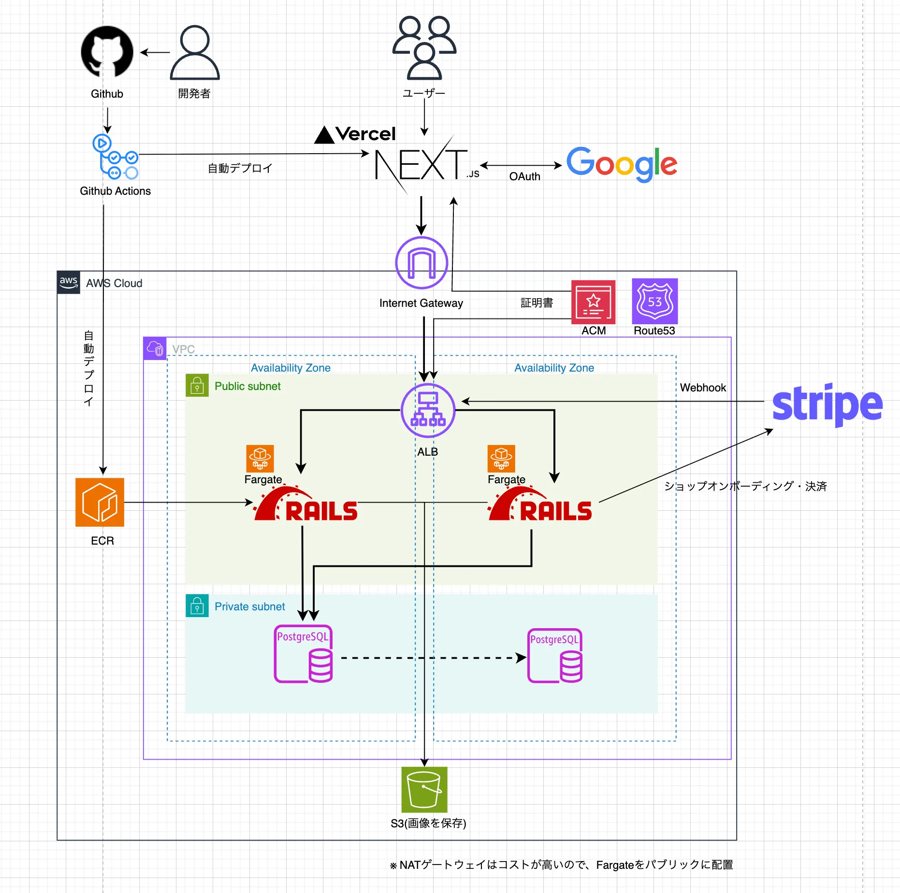

# Digital Ichiba (Infra)

これはShuのポートフォリオの、Digital Ichibaのインフラのリポジトリです。  
Fargateで手動デプロイしたものを、terraform importで、取り込みました。

## 概要
Digital Ichiba は、  
ハンドメイド作家や小規模ブランド、  
セレクトショップのオーナー向けに設計された、  
オンライン販売プラットフォームです。

初期設定を最小限に抑え、  
最短5分で商品ページを公開し、販売を開始できます。  
シングルページアプリケーション（SPA）によるスムーズな操作性と、  
Stripeを利用した安全で信頼性の高い決済機能を備えています。

スマートフォン・パソコン・タブレットなど、  
デバイスを問わず快適に利用できるUIにより、  
商品ページの閲覧から購入までをスムーズに行えます。

複雑な設定や運用に悩むことなく、  
「作る・伝える・売る」ことに集中できる環境を提供します。

## 構成図



## バージョン情報
このリポジトリのバージョン情報です。  
Terraform 1.14.0 / AWS Provider 6.25  

## 管理している主なリソース（抜粋）
- **Network**: VPC / Subnet / Route Table / IGW / Security Group
- **ALB**: HTTPS Listener / Target Group
- **ECS**: Cluster / Service（タスク定義まわり）
- **ECR**: コンテナイメージの格納
- **RDS**: PostgreSQL
- **S3**: 画像等のストレージ用途
- **Route53 / ACM**: ドメイン / 証明書
- **IAM**: ECS実行ロール / タスクロール / GitHub Actions OIDC

## セットアップ（Terraform）

### 前提
- AWSアカウント
- Terraformが実行できる環境（`terraform` コマンド）

### 使い方

```bash
terraform init
terraform plan
terraform apply
```

### 変数
- `terraform.tfvars` に環境に応じた値を設定します。


